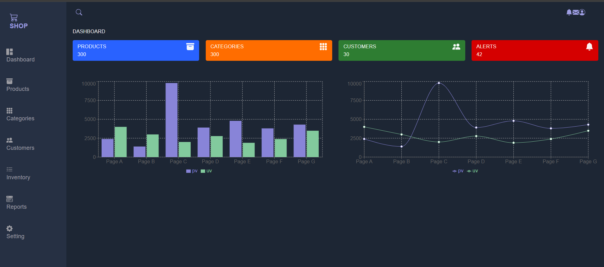

# Admin Dashboard

It  is an admin dashboard made using ReactJs and styled using TailwindCSS. An admin dashboard is a vital component of an admin panel as it allows the user to visualize the data at a glance. The dashboard is composed of charts, graphs, and other visualization features which frees the user from wasting time sifting through and processing large amounts of data.

## How it  looks
All the features of the admin dashboard can be seen in the image attached below.  

## 🛠️ Techstacks
HTML, TailwindCss, ReactJs, React Hooks

## Author
 Bibek Gauli
